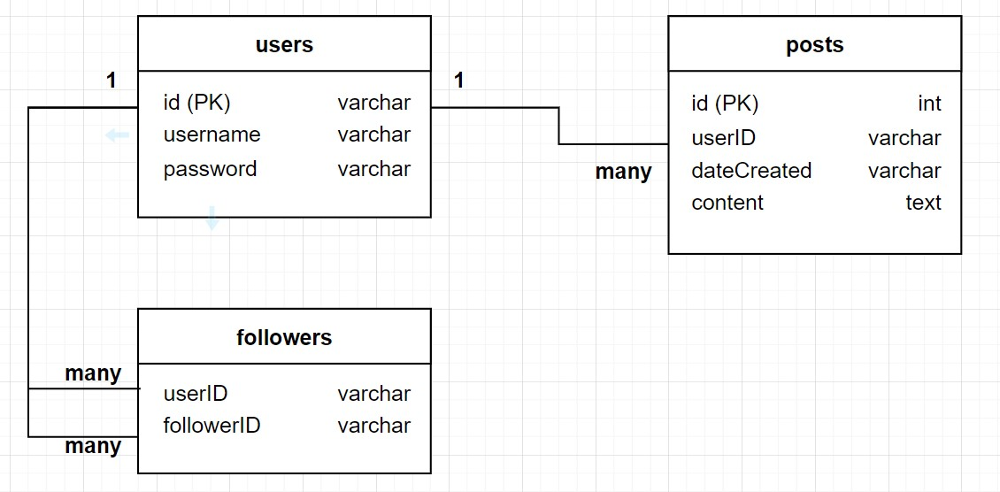
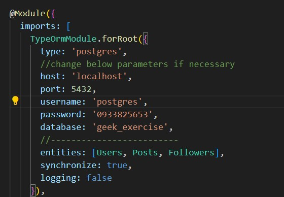
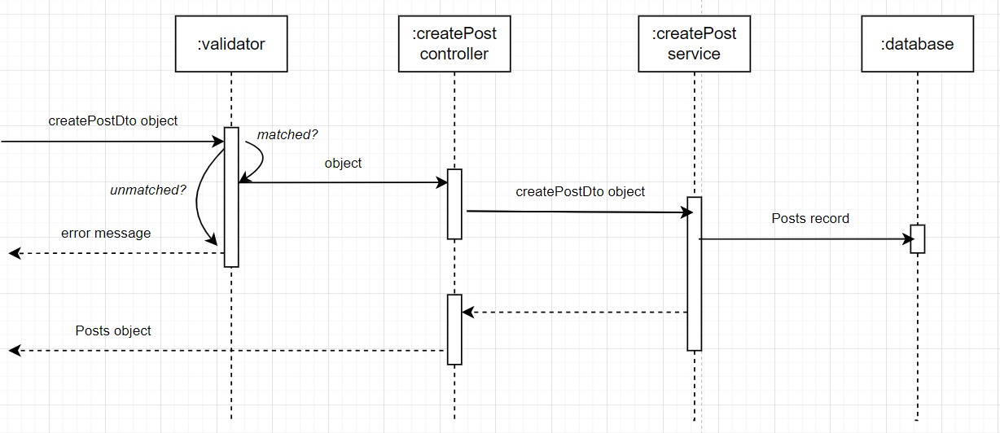
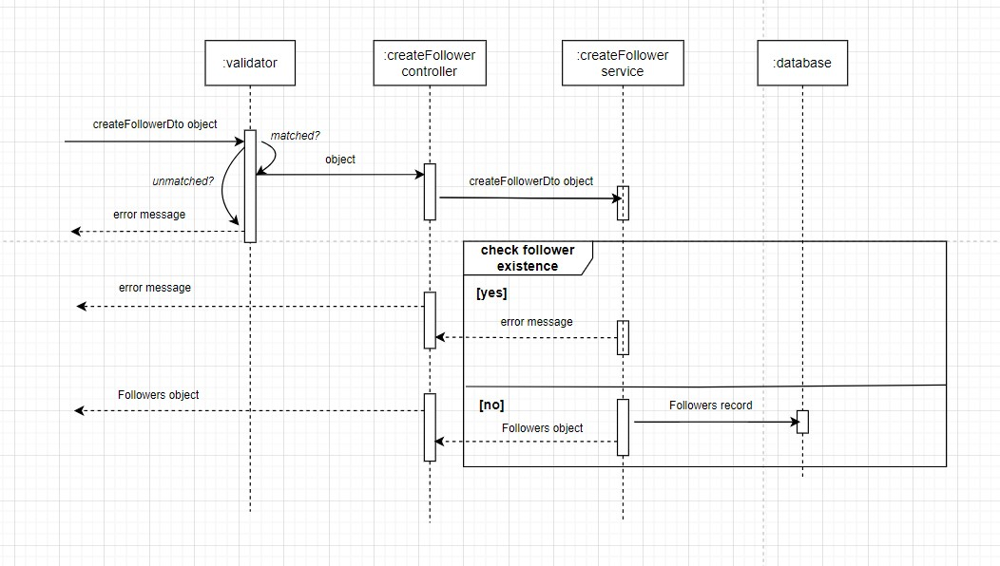
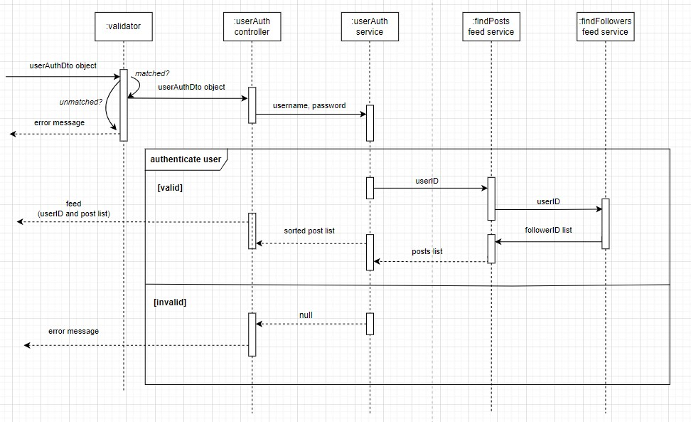

## Database Schema

## Connect to database

- Database connection module is in app.module
- Some parameters need to be changed depending on the database properties

## Populate data into database

- Insert sample data into all tables in database by calling the following endpoint
  
  Method: POST
  
  Endpoint: http://localhost:3000/populateDB

- You can insert sample data into a single table
  
  => NOTE: 'users' table should be populated first to prevent foreign key constraint error

  Method: POST
  
  "users" table: http://localhost:3000/users/createUsers

  "posts" table: http://localhost:3000/posts/createPosts

  "followers" table: http://localhost:3000/followers/createFollowers

## Post creation

- Call the following endpoint with proper API body to create post

  Method: POST

  Endpoint: http://localhost:3000/posts/createPost

  Body:
      
      {
        userID: string,
        content: string
      }

- Post creation flow

  

## Following users

- Call the following endpoint with proper API body to create follower

  Method: POST

  Endpoint: http://localhost:3000/posts/createPost

  Body:
      
      {
        userID: string,
        followerID: string
      }

- Post creation flow

  

## Feed generation and retrieval

- Call the following endpoint with proper API body to login and retrieve feed

    Method: GET

    Endpoint: http://localhost:3000/auth/login

    Body:
        
        {
          username: string,
          password: string
        } 
- As an user successfully login, userID is returned, which is used to retrieve feed respectively

- Login and feed retrieval flow:

  